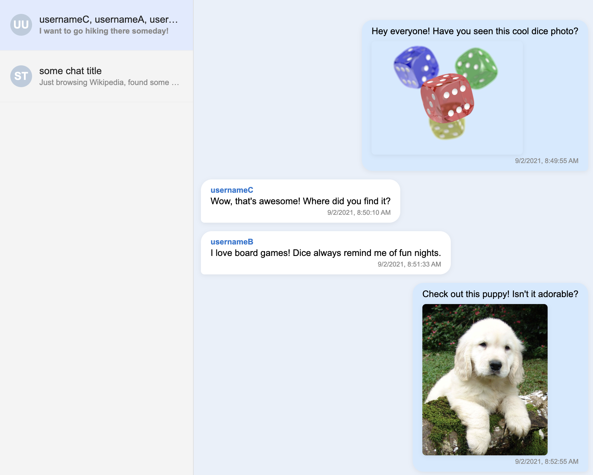

# Skype Export Reader

A web-based viewer for exported Skype chat history (messages.json). Easily browse, search, and analyze your Skype conversations and attachments in your browser.



## Features
- Parses and displays Skype chat history from exported `messages.json` files
- Shows chat list, message history, and media attachments
- Supports image embedding and media file linking
- English interface and comments

## Project Structure
- `parser.js` — Main JavaScript logic for loading, parsing, and rendering chats and messages
- `messages.json` — Exported Skype chat data (required)
- `endpoints.json` — (Optional) Contains device and media endpoint information
- `media/` — (Optional) Folder with media files and metadata
- `index.html` — Main HTML file for the web interface

## How to Use

> **Export your Skype data:** You can export your Skype chat history and media from the official Skype export page: [https://secure.skype.com/en/data-export](https://secure.skype.com/en/data-export)

1. **Export your Skype data** from Skype (usually via Microsoft privacy dashboard)
2. Place `messages.json` (and optionally `endpoints.json`, `media/`) in the project folder
3. Start a local server in the project directory:
   ```sh
   python3 -m http.server
   ```
4. Open [http://localhost:8000](http://localhost:8000) in your browser
5. Browse your chats and messages in a convenient interface

## Requirements
- Modern web browser (Chrome, Firefox, Edge, Safari)
- Python 3 (for simple local server)

## Customization
- You can edit `parser.js` to change how messages are displayed or add new features
- All comments and interface elements are in English for easy collaboration

## License
MIT License

---

*Created for personal use and data analysis. Not affiliated with Microsoft or Skype.* 